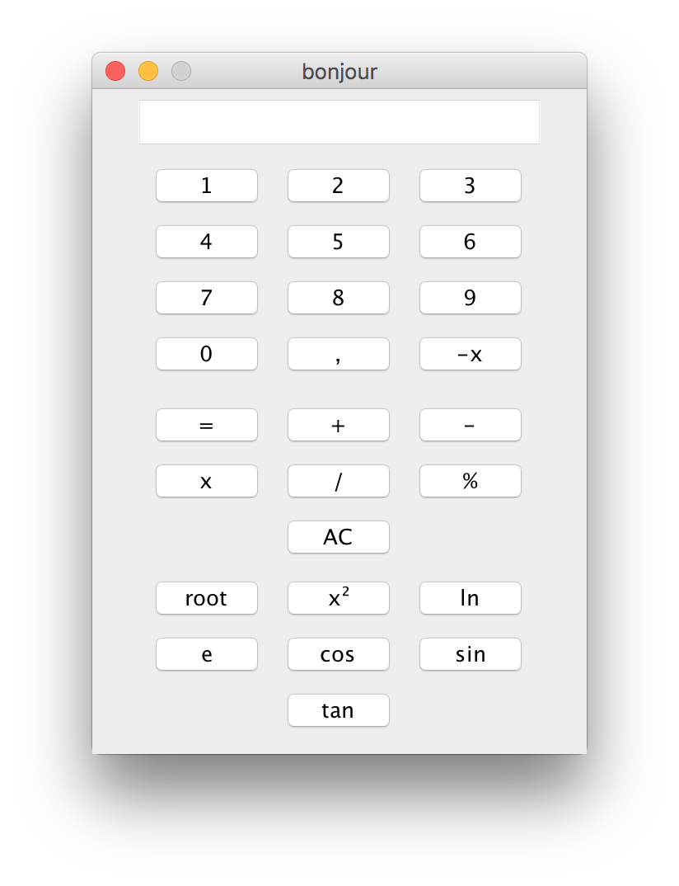

# SimpleCount

Just a third year project.
The goal was to create a simple calculator in Java, it was the first project of the java module.
  
The project was coded and tested on Eclipse IDE.

## 2019 March update
  I have updated it because the buttons was not print correctly in the user interface. Now there are ;-) 
  (However I have only tested on my machine for now (mac OS High Sierra), I will test on Linux and Windows later.)

